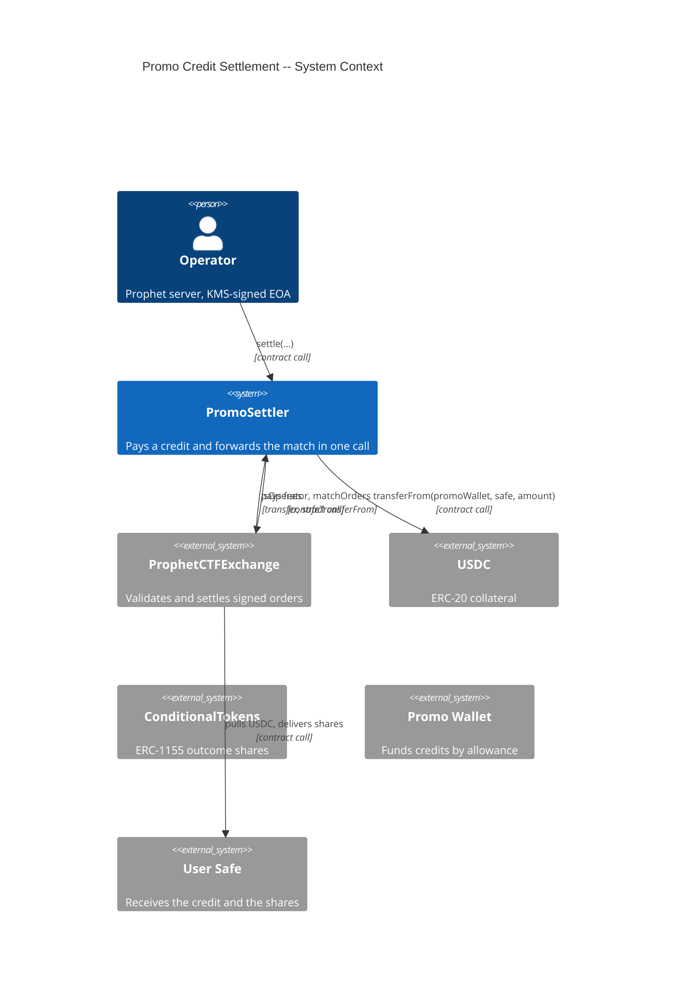
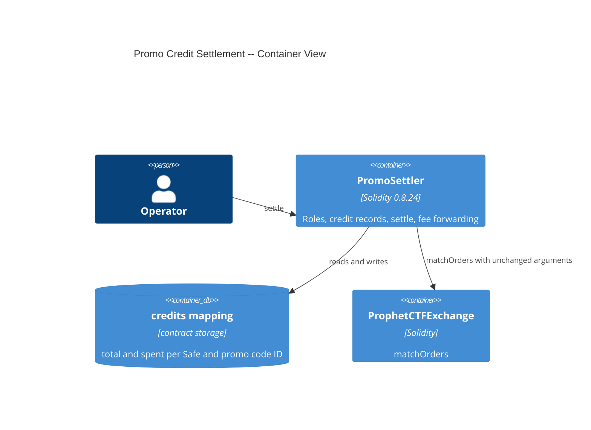
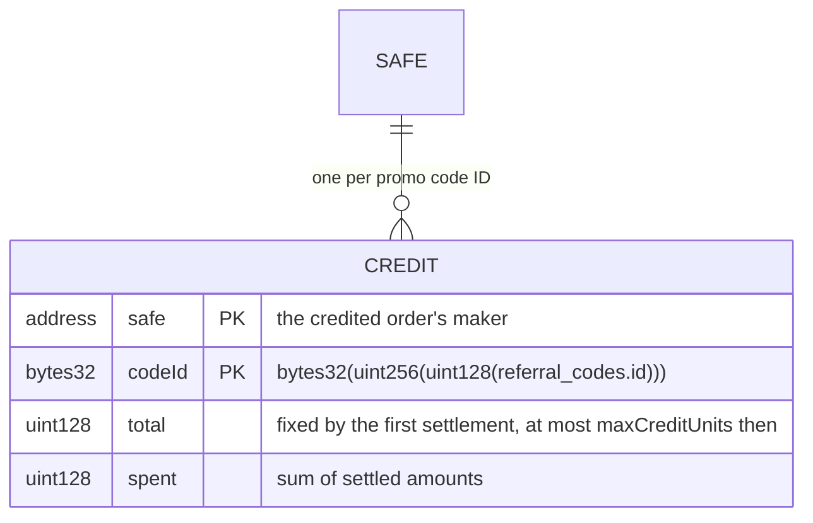
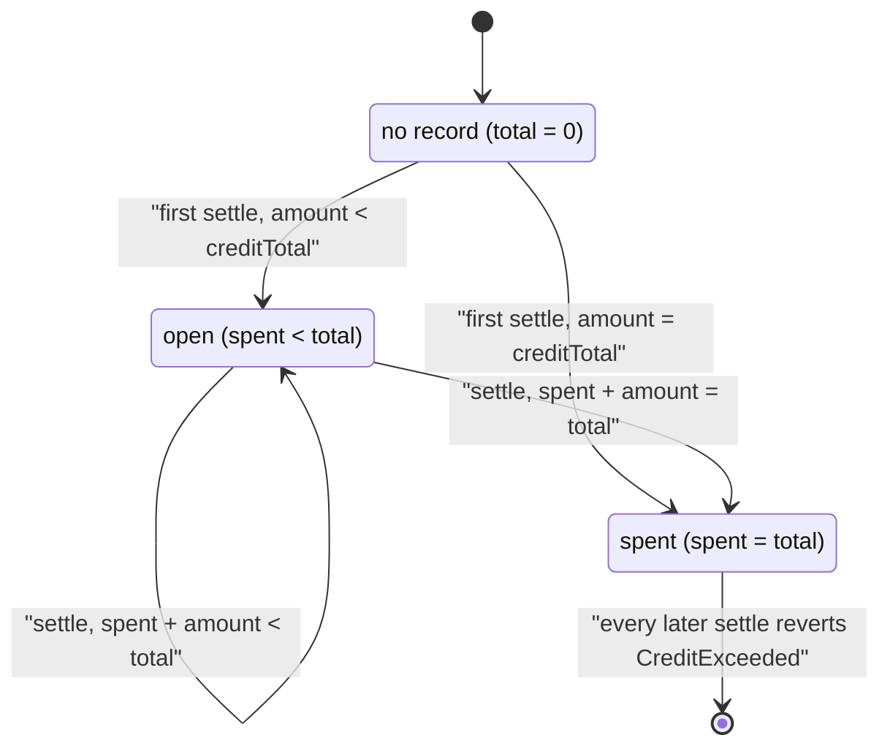

# Architecture: Promo Credit Settlement

## System Context (C4 L1)

## Container View (C4 L2)

## Data Model

**Invariants:**
- `credits[safe][codeId].spent <= credits[safe][codeId].total`, always.
- `credits[safe][codeId].total` never changes after the first settlement for that pair.
- The settler's USDC balance and its balance of every token ID in the settled orders are 0 after every `settle`.

## Component Inventory

| File | Role | Key Exports |
|------|------|-------------|
| `src/PromoSettler.sol` | business logic | `PromoSettler`, `settle`, `credits`, `onERC1155Received`, `onERC1155BatchReceived`, `supportsInterface`, `CreditSettled` |
| `test/fixtures/MockERC20.sol` | test fixture | `MockERC20` (USDC stand-in) |
| `test/fixtures/ConditionalTokensFixture.sol` | test fixture | real Conditional Tokens deployer, binary condition helper |
| `test/fixtures/ExchangeFixture.sol` | test fixture | real exchange deployer, stub Safe factory, Safe and EOA order signers |
| `test/fixtures/PromoSettlerFixture.sol` | test fixture | settler deployment, promo wallet funding, market setup |
| `test/artifacts/ProphetCTFExchange.json` | test fixture | vendored exchange bytecode at ProphetMarket/contracts `b5903f1` |
| `test/features/FEAT-UFXS-promo-credit-settlement/UC-UFXV-settle-a-credited-trade.t.sol` | test | integration and fuzz tests for UC-UFXV |

## Event Topology

| Event | Publisher | Payload | Condition | Consumers |
|-------|-----------|---------|-----------|-----------|
| `CreditSettled` | `PromoSettler.settle` | `safe` (indexed), `codeId` (indexed), `operator` (indexed), `amount`, `spent`, `total` | once per successful settlement, before the external calls | the server's listener and auditors (no consumer today) |

**Non-events (explicit):**
- Every refused settlement (SC-UFY4 to SC-UFYB): no `CreditSettled`.

## API Surface

| Method | Path | Handler | Auth | Request Shape | Response Shape | Error Codes |
|--------|------|---------|------|---------------|----------------|-------------|
| call | `settle(bytes32,uint128,uint128,uint256,Order,Order[],uint256,uint256[])` | `PromoSettler.settle` | settler operator and exchange operator | `codeId, creditTotal, amount, creditedIndex, takerOrder, makerOrders, takerFillAmount, makerFillAmounts` | — | `NotOperator`, `NotExchangeOperator`, `SettlerPaused`, `Reentrancy`, `CreditedIndexOutOfRange`, `CreditedOrderNotSafeBuy`, `ZeroAmount`, `AmountAboveFill`, `CreditTotalAboveMaximum`, `CreditTotalMismatch`, `CreditExceeded`, `TransferFailed`, any exchange error |
| view | `credits(address,bytes32)` | public mapping | none | `safe, codeId` | `total, spent` | — |
| call | `onERC1155Received`, `onERC1155BatchReceived` | receiver hooks | `msg.sender == ctf` | ERC-1155 hook arguments | the hook selector | `NotConditionalTokens` |
| view | `supportsInterface(bytes4)` | ERC-165 | none | `interfaceId` | `bool` | — |

## Integration Points

| System | Protocol | Direction | Purpose |
|--------|----------|-----------|---------|
| ProphetCTFExchange | contract call | outbound | `isOperator(caller)`, `matchOrders(...)`, `getCollateral()`, `getCtf()` |
| USDC | ERC-20 call | outbound | pull the credit from the promo wallet, forward USDC fees |
| ConditionalTokens | ERC-1155 call and hook | bidirectional | receive share fees, forward them with `safeTransferFrom` |

## State Transitions

## Code Map

| Spec ID | Spec Name | Implementation Files |
|---------|-----------|---------------------|
| UC-UFXV | Settle a Credited Trade | `src/PromoSettler.sol:settle()` |
| SC-UFY0 | Credited initial bet mints the shares into the Safe | `src/PromoSettler.sol:settle()`, `src/PromoSettler.sol:_safeTransferFrom()` |
| SC-UFY1 | Credited BUY fills against a house SELL | `src/PromoSettler.sol:settle()` |
| SC-UFY2 | Credited resting order fills as a maker | `src/PromoSettler.sol:_creditedOrder()` |
| SC-UFY3 | Second settlement spends only the remainder | `src/PromoSettler.sol:_recordCredit()` |
| SC-UFY4 | Settlement above the recorded credit is refused | `src/PromoSettler.sol:_recordCredit()` |
| SC-UFY5 | First credit total above the maximum is refused | `src/PromoSettler.sol:_recordCredit()` |
| SC-UFY6 | Changed credit total is refused | `src/PromoSettler.sol:_recordCredit()` |
| SC-UFY7 | Amount above the fill or zero is refused | `src/PromoSettler.sol:settle()` |
| SC-UFY8 | Credited order that is not a Safe BUY is refused | `src/PromoSettler.sol:_creditedOrder()`, `src/PromoSettler.sol:settle()` |
| SC-UFY9 | Match the exchange rejects leaves the credit unspent | `src/PromoSettler.sol:settle()` |
| SC-UFYA | Caller not an operator of both is refused | `src/PromoSettler.sol:onlyOperator`, `src/PromoSettler.sol:onlyExchangeOperator` |
| SC-UFYB | Paused settler refuses settlement | `src/PromoSettler.sol:whenNotPaused` |
| SC-UFYC | Fees reach the operator and the settler ends empty | `src/PromoSettler.sol:_forwardFees()` |
| SC-UFYD | Price-improvement refund stays in the Safe | `src/PromoSettler.sol:settle()` |
| SC-UFYE | Tokens from another contract are refused | `src/PromoSettler.sol:onERC1155Received()`, `src/PromoSettler.sol:onERC1155BatchReceived()`, `src/PromoSettler.sol:supportsInterface()` |

## Architecture Decisions

**ADR-UFZ9:** The promo wallet funds credits through a finite allowance
In the context of paying credits from a campaign budget, facing the risk of a compromised operator key, we decided that the promo wallet keeps the budget and approves the settler for a finite allowance, to achieve a worst-case loss equal to the allowance and a one-transaction stop (`approve(settler, 0)`), accepting that the promo wallet key must sign a new `approve` when the budget changes.

**ADR-UFZA:** One credit record per Safe and promo code ID, fixed by its first settlement
In the context of a server that draws one credit across several trades, facing retries and repeats that paid one $1.00 credit up to 37 times, we decided to key the record by the credited order's maker and the promo code ID and to fix its total at the first settlement, to achieve an on-chain cap that no server path can pass, accepting that a credit total cannot be corrected after its first settlement.

**ADR-UFZB:** `settle` checks the caller on the settler and on the exchange
In the context of a settler that holds the exchange operator role, facing a settler admin who could otherwise grant exchange-operator power by adding a settler operator, we decided that `settle` also requires `exchange.isOperator(msg.sender)`, to achieve that a drift between the two registries can remove access but never add it, accepting one extra external call per settlement.

**ADR-UFZC:** The settler forwards every fee to the caller and holds nothing at rest
In the context of an exchange that pays fees to `msg.sender`, which is the settler, we decided to forward the settler's whole USDC balance and its whole balance of every token ID in the orders to the caller after the match, to achieve unchanged operator balances and fee tools and a contract with nothing to steal between calls, accepting that a donation made inside the same transaction also reaches the operator.

**ADR-UFZD:** The settler imports only the exchange's `Order` struct and enums
In the context of a contract that forwards signed orders, facing a hand-copied struct that could drift from the exchange's typehash layout without a compile error, we decided to import `Order`, `Side`, and `SignatureType` from `exchange/libraries/OrderStructs.sol` and to declare every other interface inline, to achieve an exact order layout with no implementation library in `src/`, accepting a submodule dependency on ctf-exchange.

## Testing Decisions

| Service/Pattern | Decision | Reason |
|-----------------|----------|--------|
| ProphetCTFExchange | fixture | The tests deploy the vendored bytecode Prophet runs on Polygon, so a settlement drives the real matching code. |
| ConditionalTokens | fixture | The tests deploy the real Gnosis bytecode from `lib/ctf-exchange/artifacts`, so mints and share fees follow production. |
| Poly Safe factory | mock | The exchange reads only `masterCopy()` from the factory, so a stub that answers it lets the exchange derive each Safe by CREATE2. |
