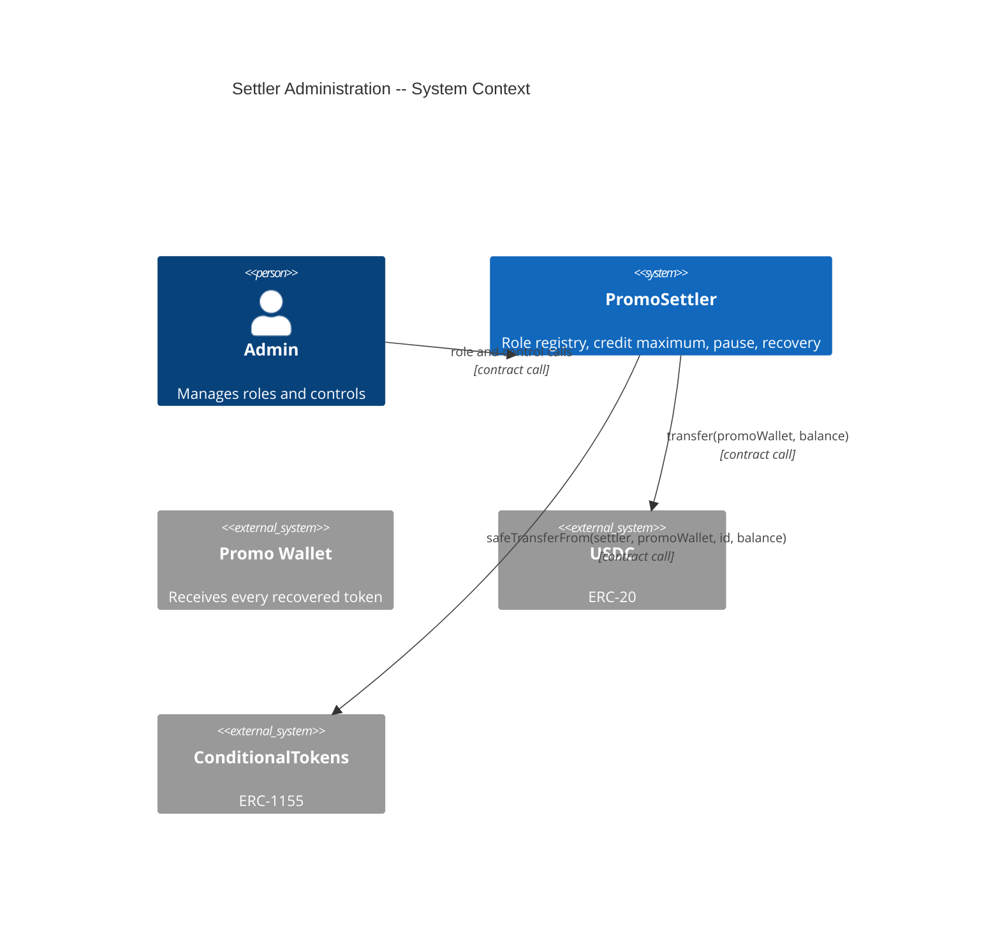
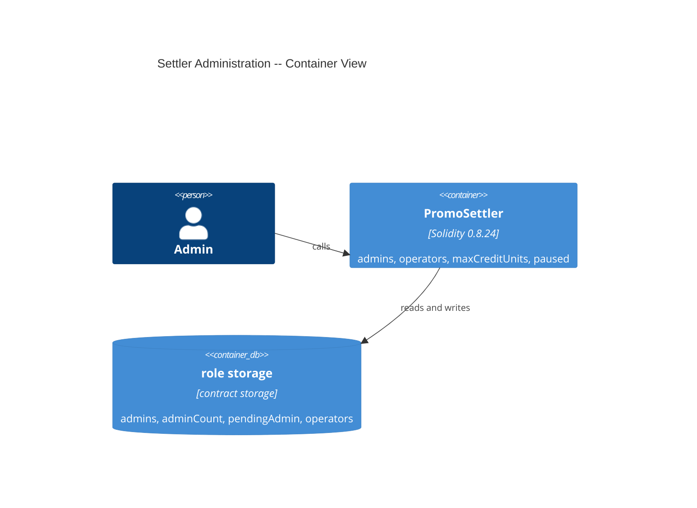
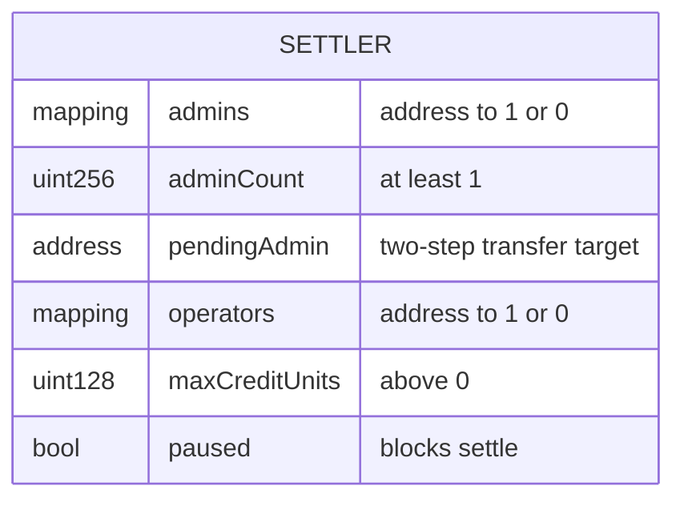

# Architecture: Settler Administration

## System Context (C4 L1)

## Container View (C4 L2)

## Data Model

**Invariants:**
- `adminCount` equals the number of addresses with `admins(address) = 1`, and it is at least 1.
- `pendingAdmin` is never an address that was removed or renounced after it was proposed.
- `maxCreditUnits` is above 0.

## Component Inventory

| File | Role | Key Exports |
|------|------|-------------|
| `src/PromoSettler.sol` | business logic | `addAdmin`, `removeAdmin`, `renounceAdminRole`, `transferAdmin`, `acceptAdmin`, `addOperator`, `removeOperator`, `setMaxCreditUnits`, `pause`, `unpause`, `recover` |
| `test/features/FEAT-UFXT-settler-administration/UC-UFXW-manage-settler-roles.t.sol` | test | integration tests for UC-UFXW |
| `test/features/FEAT-UFXT-settler-administration/UC-UFXX-control-credit-settlement.t.sol` | test | integration tests for UC-UFXX |

## Event Topology

| Event | Publisher | Payload | Condition | Consumers |
|-------|-----------|---------|-----------|-----------|
| `NewAdmin` | `addAdmin`, `acceptAdmin` | `newAdminAddress`, `admin` | every successful call | admin tooling |
| `RemovedAdmin` | `removeAdmin`, `renounceAdminRole` | `removedAdmin`, `admin` | every successful call | admin tooling |
| `AdminTransferProposed` | `transferAdmin` | `currentAdmin`, `proposedAdmin` | every successful call | admin tooling |
| `NewOperator` | `addOperator` | `newOperatorAddress`, `admin` | every successful call | admin tooling |
| `RemovedOperator` | `removeOperator` | `removedOperator`, `admin` | every successful call | admin tooling |
| `MaxCreditUnitsUpdated` | `setMaxCreditUnits` | `oldValue`, `newValue` | every successful call | admin tooling |
| `Paused` / `Unpaused` | `pause` / `unpause` | `admin` | every successful call | the server |
| `Recovered` | `recover` | `tokenId`, `amount` | a non-zero balance moved | reconciliation |

**Non-events (explicit):**
- A refused call (SC-UFYF, SC-UFYP, SC-UFYQ): no event.

## API Surface

| Method | Path | Handler | Auth | Request Shape | Response Shape | Error Codes |
|--------|------|---------|------|---------------|----------------|-------------|
| call | `addAdmin(address)` | `PromoSettler` | admin | `admin_` | — | `NotAdmin`, `ZeroAddress` |
| call | `removeAdmin(address)` | `PromoSettler` | admin | `admin` | — | `NotAdmin`, `CannotRemoveLastAdmin` |
| call | `renounceAdminRole()` | `PromoSettler` | admin | — | — | `NotAdmin`, `CannotRemoveLastAdmin` |
| call | `transferAdmin(address)` | `PromoSettler` | admin | `newAdmin` | — | `NotAdmin`, `ZeroAddress`, `AlreadyAdmin` |
| call | `acceptAdmin()` | `PromoSettler` | pending admin | — | — | `NotPendingAdmin`, `AlreadyAdmin` |
| call | `addOperator(address)`, `removeOperator(address)` | `PromoSettler` | admin | `operator_` | — | `NotAdmin` |
| call | `setMaxCreditUnits(uint128)` | `PromoSettler` | admin | `newMax` | — | `NotAdmin`, `ZeroMaxCredit` |
| call | `pause()`, `unpause()` | `PromoSettler` | admin | — | — | `NotAdmin` |
| call | `recover(uint256)` | `PromoSettler` | admin | `tokenId` (0 = USDC) | — | `NotAdmin`, `NothingToRecover`, `Reentrancy`, `TransferFailed` |

## Integration Points

| System | Protocol | Direction | Purpose |
|--------|----------|-----------|---------|
| USDC | ERC-20 call | outbound | recover USDC to the promo wallet |
| ConditionalTokens | ERC-1155 call | outbound | recover outcome shares to the promo wallet |

## Code Map

| Spec ID | Spec Name | Implementation Files |
|---------|-----------|---------------------|
| UC-UFXW | Manage Settler Roles | `src/PromoSettler.sol` |
| SC-UFYF | Caller outside the admins is refused | `src/PromoSettler.sol:onlyAdmin` |
| SC-UFYG | Admin adds and removes an operator | `src/PromoSettler.sol:addOperator()`, `src/PromoSettler.sol:removeOperator()` |
| SC-UFYH | Admin adds and removes an admin | `src/PromoSettler.sol:addAdmin()`, `src/PromoSettler.sol:removeAdmin()` |
| SC-UFYI | Last admin cannot leave | `src/PromoSettler.sol:removeAdmin()`, `src/PromoSettler.sol:renounceAdminRole()` |
| SC-UFYJ | Admin transfer takes two steps | `src/PromoSettler.sol:transferAdmin()`, `src/PromoSettler.sol:acceptAdmin()` |
| SC-UFYK | Removal withdraws a pending transfer | `src/PromoSettler.sol:removeAdmin()`, `src/PromoSettler.sol:renounceAdminRole()` |
| UC-UFXX | Control Credit Settlement | `src/PromoSettler.sol` |
| SC-UFYL | Admin sets the credit maximum | `src/PromoSettler.sol:setMaxCreditUnits()` |
| SC-UFYM | Admin pauses and unpauses | `src/PromoSettler.sol:pause()`, `src/PromoSettler.sol:unpause()` |
| SC-UFYN | Admin recovers stray USDC | `src/PromoSettler.sol:recover()` |
| SC-UFYO | Admin recovers a stray outcome token | `src/PromoSettler.sol:recover()` |
| SC-UFYP | Recovery of a zero balance is refused | `src/PromoSettler.sol:recover()` |
| SC-UFYQ | Caller outside the admins cannot use the controls | `src/PromoSettler.sol:onlyAdmin` |

## Architecture Decisions

**ADR-UFZE:** The role registry is the lp-vaults factory registry without the oracle
In the context of a settler that needs admins and operators, facing a new registry that no auditor has read, we decided to copy the registry of `lp-vaults/src/LPVaultFactory.sol` with its departure from the exchange's `Auth` mixin (removal clears a matching `pendingAdmin`) and without the oracle role, to achieve a registry that already passed an audit round, accepting a second registry that the admin must keep in step with the exchange's.

**ADR-UFZF:** Recovery sends only to the immutable promo wallet
In the context of a contract that holds nothing at rest, facing a compromised admin key, we decided that `recover` takes a token ID and no destination and always sends to `promoWallet`, to achieve that no admin key can take a stray token, accepting that a token sent by mistake goes to the promo wallet and not to its sender.

## Testing Decisions

| Service/Pattern | Decision | Reason |
|-----------------|----------|--------|
