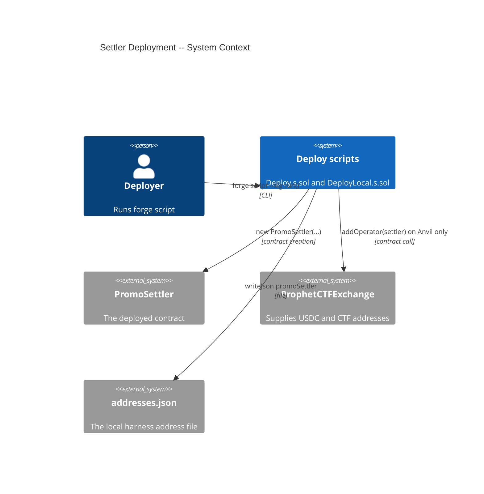
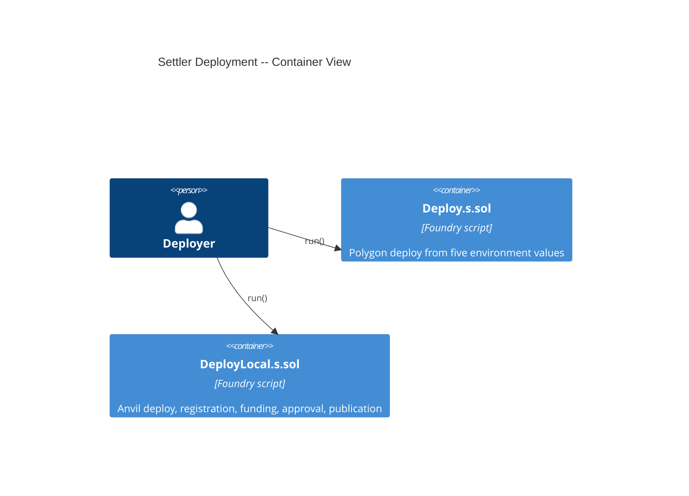

# Architecture: Settler Deployment

## System Context (C4 L1)

## Container View (C4 L2)

## Component Inventory

| File | Role | Key Exports |
|------|------|-------------|
| `script/Deploy.s.sol` | deploy script | `DeployConfig`, `Deploy.run()`, `run(address)`, `run(address,DeployConfig)` |
| `script/DeployLocal.s.sol` | deploy script | `LocalConfig`, `DeployLocal.run()`, `run(address)`, `run(address,LocalConfig)` |
| `.env.example` | configuration | the five Polygon deploy variables |
| `DEPLOYMENT.md` | runbook | deploy, register, approve, and check steps |
| `foundry.toml` | configuration | `fs_permissions` for the addresses file |
| `test/features/FEAT-UFXU-settler-deployment/UC-UFXY-deploy-the-settler-to-polygon.t.sol` | test | integration tests for UC-UFXY |
| `test/features/FEAT-UFXU-settler-deployment/UC-UFXZ-deploy-the-settler-to-local-anvil.t.sol` | test | integration tests for UC-UFXZ |

## Event Topology

**Not applicable:** the scripts emit no events of their own. The settler's constructor emits none, and the exchange's `NewOperator` is asserted as a side effect of SC-UFYU.

## API Surface

| Method | Path | Handler | Auth | Request Shape | Response Shape | Error Codes |
|--------|------|---------|------|---------------|----------------|-------------|
| script | `Deploy.run()` / `run(address)` / `run(address,DeployConfig)` | `script/Deploy.s.sol` | the broadcasting key | `exchange, promoWallet, admin, operator, maxCreditUnits` | the settler address | `ZeroAddress(string)`, `ZeroMaxCreditUnits()`, `MaxCreditUnitsTooLarge()` |
| script | `DeployLocal.run()` / `run(address)` / `run(address,LocalConfig)` | `script/DeployLocal.s.sol` | deployer and promo wallet keys | `addressesPath, exchange, promoWallet, maxCreditUnits, localPromoFundUnits` | the settler address | `UnexpectedChainId(uint256,uint256)`, `ZeroAddress(string)`, `ZeroMaxCreditUnits()`, `MaxCreditUnitsTooLarge()`, `ZeroFundUnits()` |
| call | `constructor(address,address,address,address,uint128)` | `PromoSettler` | none | `exchange, promoWallet, admin, operator, maxCreditUnits` | — | `ZeroAddress()`, `ZeroMaxCredit()` |

## Integration Points

| System | Protocol | Direction | Purpose |
|--------|----------|-----------|---------|
| ProphetCTFExchange | contract call | outbound | `getCollateral()`, `getCtf()`; `addOperator(settler)` on Anvil |
| Local USDC | contract call | outbound | `mint(promoWallet, amount)` and `approve(settler, amount)` on Anvil |
| addresses.json | file | bidirectional | read `exchange` and `deployer`; write `promoSettler` |

## Code Map

| Spec ID | Spec Name | Implementation Files |
|---------|-----------|---------------------|
| UC-UFXY | Deploy the Settler to Polygon | `script/Deploy.s.sol` |
| SC-UFYR | Deploy with a complete configuration | `script/Deploy.s.sol:_deploy()`, `src/PromoSettler.sol:constructor` |
| SC-UFYS | Deploy reads its configuration from the environment | `script/Deploy.s.sol:_configFromEnv()` |
| SC-UFYT | A missing, zero, or out-of-range value is refused | `script/Deploy.s.sol:_validate()`, `src/PromoSettler.sol:constructor` |
| UC-UFXZ | Deploy the Settler to Local Anvil | `script/DeployLocal.s.sol` |
| SC-UFYU | Local deploy registers, funds, approves, and publishes | `script/DeployLocal.s.sol:_run()` |
| SC-UFYV | Local deploy reads the addresses file and the environment | `script/DeployLocal.s.sol:_configFromEnv()` |
| SC-UFYW | Local deploy refuses a chain other than Amoy | `script/DeployLocal.s.sol:_run()` |

## Architecture Decisions

**ADR-UFZG:** One environment reader and a struct overload in each deploy script
In the context of scripts that tests must drive, facing environment reads scattered through a deploy, we decided that `_configFromEnv()` is the only function that reads the environment and that `run(deployer, cfg)` takes the struct directly, to achieve tests that build a configuration without the environment, accepting three `run` overloads per script.

**ADR-UFZH:** The local deploy is this repository's own script, run as a third step
In the context of the server's local harness, facing a meta project that already runs contracts-poly-safe as its own project, we decided to deploy the settler with `script/DeployLocal.s.sol` from `lib/promo-settler`, to achieve a local deploy that ships with the contract it deploys, accepting two `fs_permissions` entries and a path conversion in the server's Makefile.

**ADR-UFZI:** The local-deploy test writes its addresses file under `./tmp/`
In the context of a test that must run the file write, facing a production path that resolves outside this repository, we decided that the test writes a scratch file under the git-ignored `./tmp/` and passes that path in `LocalConfig`, to achieve a test that never touches a real addresses file, accepting one extra `fs_permissions` entry.

## Testing Decisions

| Service/Pattern | Decision | Reason |
|-----------------|----------|--------|
| addresses.json file | isolate | Each test writes its own scratch file under `./tmp/`, so the test never reads or changes the harness file. |
| Chain ID guard | pin | The chain-guard test sets the chain ID with `vm.chainId`, so both the refused and the accepted chain run in one suite. |
